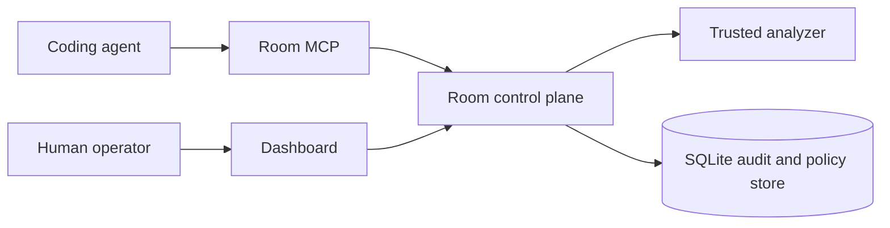
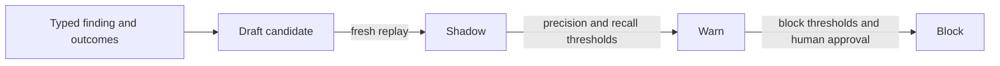

# Room

Room is a self-hosted guardrail control plane for coding agents. It publishes
immutable, scoped rulesets; evaluates trusted analyzer receipts; governs typed
MCP identities; and records durable audit events.



## Capabilities

- ConnectRPC and Protobuf admin/agent APIs.
- Four focused MCP tools: `room_get_rules`, `room_analyze_plan`, `room_check_diff`, and `room_open_policy_control`.
- Scoped opaque bearer credentials with separate admin and agent roles.
- A strict external-analyzer boundary: policy never classifies prompt, plan, diff, title, or display text.
- SQLite persistence for ruleset versions, MCP policy, and append-only audit events.
- A review-intelligence catalog that turns typed review claims and durable outcomes into replayed, staged policy candidates.
- Lifecycle hooks that fail closed unless `ROOM_HOOK_FAIL_OPEN=true` is explicitly set.

## Local setup

Create admin, reviewer, and repository-scoped agent credentials. Token plaintext
is written to private output files; the registry stores only SHA-256 digests.

```bash
go run ./cmd/roomctl token issue \
  --id local-admin --role admin --human-operator --output .room/admin.token

go run ./cmd/roomctl token issue \
  --id review-automation --role reviewer --output .room/reviewer.token

go run ./cmd/roomctl token issue \
  --id local-agent --role agent \
  --workspace local --repository haasonsaas/room --agent codex \
  --output .room/agent.token
```

Start `roomd`, then open `http://127.0.0.1:8787` and paste the admin token into
the in-memory token field. The dashboard does not persist tokens.

```bash
go run ./cmd/roomd
```

Without an analyzer, evaluations return `INDETERMINATE`; enforcement callers
block that result. Local development can disable authentication on a loopback
listener with `ROOM_AUTH_MODE=disabled`.

### Semgrep analyzer

The Linux Semgrep adapter scans source snapshots with the OSS `semgrep-core`
binary. The included rule detects Go HTTP input that reaches SQL query text.

```bash
go build -o ~/.local/bin/room-semgrep ./cmd/room-semgrep
```

See the [analyzer contract](docs/analyzer.md#semgrep-adapter) for the required
`semgrep-core`, repository, rule, coverage, and timeout configuration.

## Review intelligence

Room records review claims and outcomes as typed evidence. Replays measure
candidate precision and recall before each rollout promotion.



The `reviewer` credential can ingest evidence, infer candidates, run replays,
tune thresholds, and advance eligible non-protected policies. Block, pause, and
rollback require an authenticated human operator.

## MCP integration

Run the MCP sidecar separately:

```bash
ROOM_SERVER_URL=http://127.0.0.1:8787 \
ROOM_CONTROL_PLANE_URL=http://127.0.0.1:8787 \
go run ./cmd/room-mcp
```

It listens at `http://127.0.0.1:8788/mcp` by default. MCP callers must send the
same scoped agent bearer credential; the sidecar validates and forwards each
request's credential, and binds MCP sessions to that principal. `room-mcp-call`
reads `ROOM_TOKEN_FILE` for the caller.

Room uses MCP elicitation only from typed evaluation state. A blocking
evaluation with required checks, evidence, remediation, or analyzer gaps can
offer a closed-choice form (`revise`, `run_required_checks`,
`provide_evidence`, or `open_control_plane`). Allow decisions and blocking
decisions without a typed next-step contract do not elicit. Accept, decline,
cancel, unsupported-client, and error outcomes are written to the append-only
audit log and bound to the original evaluation and authenticated agent scope.

`room_open_policy_control` uses URL-mode elicitation for the human-only block,
pause, and rollback controls. Its inputs are a candidate ID, target rollout
stage, and the candidate's expected `updated_at` value. The sidecar creates the
URL only from `ROOM_CONTROL_PLANE_URL`, verifies candidate scope and freshness,
and audits both the offer and result. Opening the dashboard selects the
candidate and Rollout tab but never changes policy. The actual transition still
requires the dashboard's human-operator credential, confirmation, and
compare-and-swap checks. Do not put credentials in the control-plane URL.

### Codex

Keep general approvals locked down while allowing the user to review
MCP elicitations:

```toml
approval_policy = { granular = { sandbox_approval = false, rules = false, mcp_elicitations = true, request_permissions = false, skill_approval = false } }
approvals_reviewer = "user"
```

For reliable native Codex tool discovery, prefer the `room-mcp-stdio` entrypoint
through a Codex plugin. It reads the agent token from a private
`ROOM_TOKEN_FILE`, so the Codex GUI process does not need to inherit a bearer
token environment variable. Because the stdio server is Codex's direct MCP
peer, Room form and URL elicitations render in the native Codex UI.

```bash
go build -o ~/.local/bin/room-mcp-stdio ./cmd/room-mcp-stdio
```

The plugin MCP entry should invoke that binary with `ROOM_TOKEN_FILE`,
`ROOM_SERVER_URL`, and `ROOM_CONTROL_PLANE_URL` in its non-secret environment.
After installing or updating the plugin, start a new Codex task so its MCP tool
catalog is rebuilt from the plugin.

## Hooks and CLI

```bash
ROOM_TOKEN_FILE=.room/agent.token go run ./cmd/roomctl rules
ROOM_TOKEN_FILE=.room/agent.token go run ./cmd/roomctl hook pre-tool < hook.json
ROOM_TOKEN_FILE=.room/admin.token go run ./cmd/roomctl publish
```

The ruleset cache is a private, scoped advisory cache. Evaluations are performed
by Room and do not fall back to legacy local text heuristics when the server is
unavailable.

Credential registry changes are loaded live. Existing IDs cannot be reissued
through the bootstrap command; scope changes require the authenticated,
human-confirmed dashboard workflow, which rotates the token and records the
mutation receipt atomically without restarting `roomd` or `room-mcp`.

## Documentation

- [Architecture](docs/architecture.md)
- [Analyzer contract](docs/analyzer.md)
- [Rules](docs/rules.md)
- [Hooks](docs/hooks.md)

## Development

```bash
buf lint
buf generate
go test ./...
go test -race ./...
go vet ./...
```
